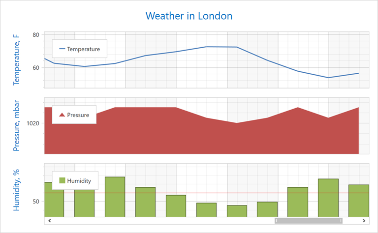

<!-- default badges list -->

<!-- default badges end -->

# Chart for WPF - Bind a Chart to Its View Model

This example shows how to use the MVVM design pattern to create a multi-pane chart, and add a separate series, legend, and y-axis to each pane.

To create chart elements from the ViewModel, use the `~ItemsSource` property to bind the chart to a collection that contains element view models. Then, specify the element's `~ItemTemplate` or `~ItemTemplateSelector` to bind the element's properties to the element view model's properties. 

For example, to create chart legends, use the [ChartControlBase.LegendItemsSource](https://docs.devexpress.com/WPF/DevExpress.Xpf.Charts.ChartControlBase.LegendItemsSource?p=netframework) and [ChartControlBase.LegendItemTemplate](https://docs.devexpress.com/WPF/DevExpress.Xpf.Charts.ChartControlBase.LegendItemTemplate?p=netframework) properties.

## Files to Look At

* [MainWindow.xaml](./CS/MvvmSample/View/MainWindow.xaml) (VB: [MainWindow.xaml](./VB/MvvmSample/View/MainWindow.xaml))
* [MainWindow.xaml.cs](./CS/MvvmSample/View/MainWindow.xaml.cs) (VB: [MainWindow.xaml.vb](./VB/MvvmSample/View/MainWindow.xaml.vb))
* [MainViewModel.cs](./CS/MvvmSample/ViewModel/MainViewModel.cs) (VB: [MainViewModel.vb](./VB/MvvmSample/ViewModel/MainViewModel.vb))
* [ChartViewModel.cs](./CS/MvvmSample/ViewModel/ChartViewModel.cs) (VB: [ChartViewModel.vb](./VB/MvvmSample/ViewModel/ChartViewModel.vb))
* [WeatherInfo.cs](./CS/MvvmSample/Model/WeatherInfo.cs) (VB: [WeatherInfo.vb](./VB/MvvmSample/Model/WeatherInfo.vb))

## Documentation

* [How to: Generate a Chart by its ViewModel](https://docs.devexpress.com/WPF/120179/controls-and-libraries/charts-suite/chart-control/examples/chart-elements/how-to-generate-a-chart-by-its-viewmodel?p=netframework)
* [Series](https://docs.devexpress.com/WPF/6339/controls-and-libraries/charts-suite/chart-control/series/series)

## More Examples

* [How to generate Series of identical view types using the MVVM binding style](https://github.com/DevExpress-Examples/how-to-generate-series-of-identical-view-types-using-the-mvvm-binding-style-t513360)
* [How to Create a Real-Time Chart](https://github.com/DevExpress-Examples/wpf-charts-create-real-time-chart)
